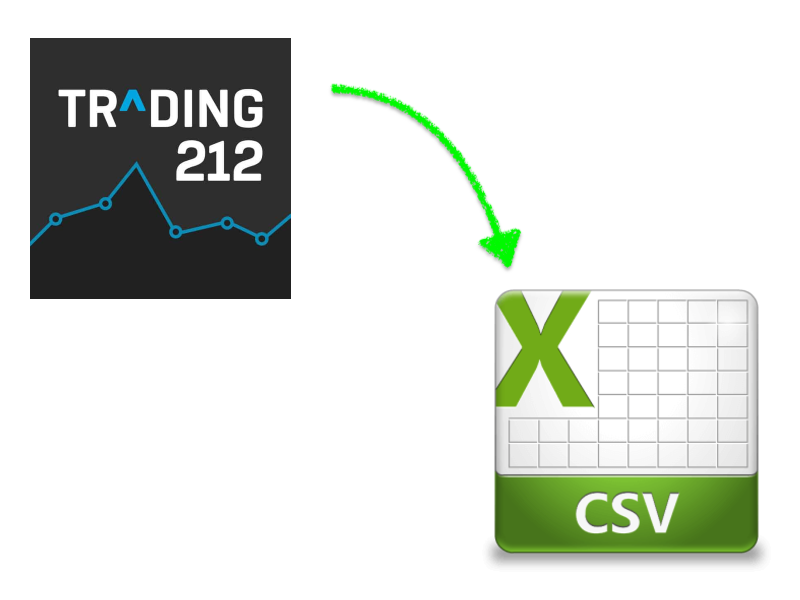

# NOTE
With the release of the new CSV export feature from Trading212, this tool is now deprecated! If you want to import to 3rd party tools like Yahoo Finance, checkout https://github.com/praveendath92/trading212-csv

# Trading 212 Csv Exporter
Exports Trading 212 transactions in CSV format and compatible with Yahoo Finance Portfolio import. 

**If you are not a techy person, checkout https://medium.com/@praveendath92/export-trading212-transactions-as-csv-yahoo-finance-298db9892a43 for detailed instructions and ask for help**

# Setup
- Update Chrome browser to latest version (tested with version 87)
- [Download and extract](http://chromedriver.chromium.org/downloads) latest version of selenium webdriver to `driver/`  (tested with version 87)
- Run `setup.sh` to install all requirements
- Copy `config.ini.sample` to `config.ini`

# Running
- Update `config.ini` with your credentials and dates
- Run `run.sh`
- If you have 2FA enabled, manual enter the code when prompted

**Start this repo if you found this helpful**
